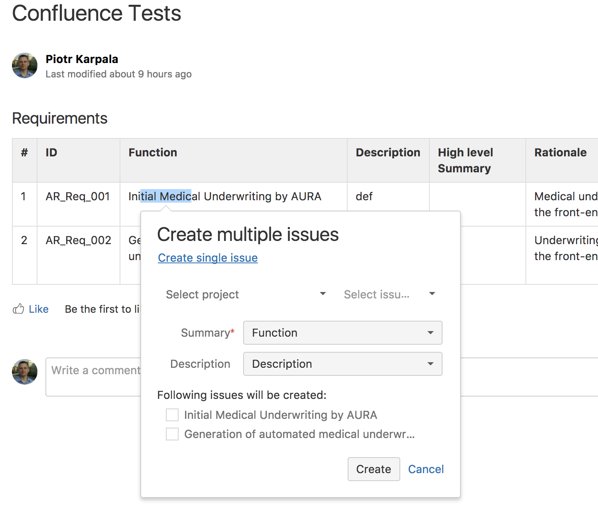
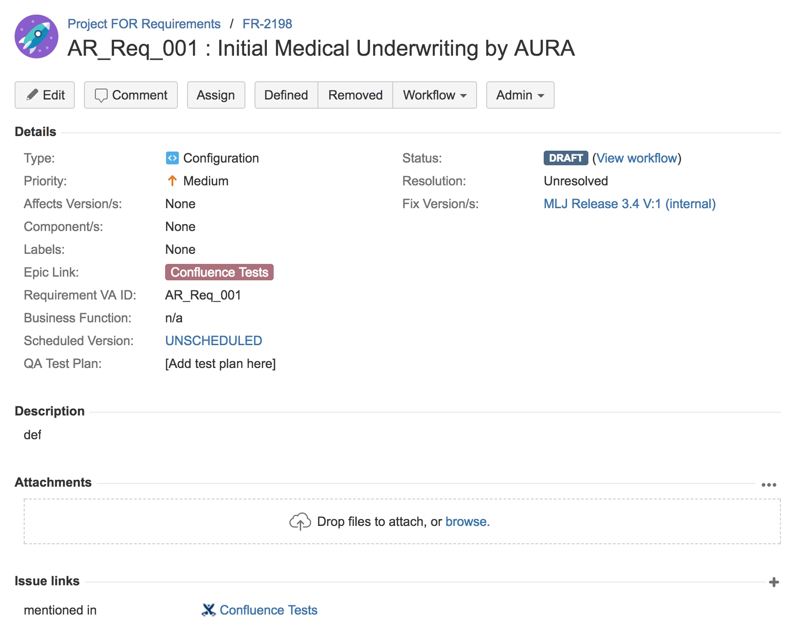
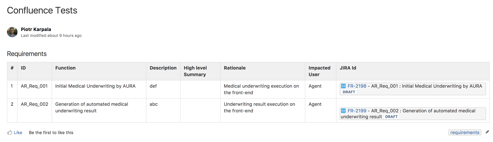

# Description
This script aims to fix issue with confluence https://jira.atlassian.com/browse/CONFCLOUD-52805 that Atlassian doesn't plan to fix.

Confluence has "Create multiple issues from the table" feature, but it doesn't work when table has **4 rows or more**, which makes it useless for most people.

Using this script you can create multiple issues from confluence page with "Requirements" table.

# Usage
Although script is configurable to some extent (see `default.json`) most of it is still hardcoded for my JIRA instance. It might change in the future if I get a feature request :)

For now - change Jira payloads in `lib\jira.js` and run
```
node yourSettings.json
```

# Sample
### 1. Confluence page with table


### 2. Issue created in Jira


### 3. Confluence Updated

